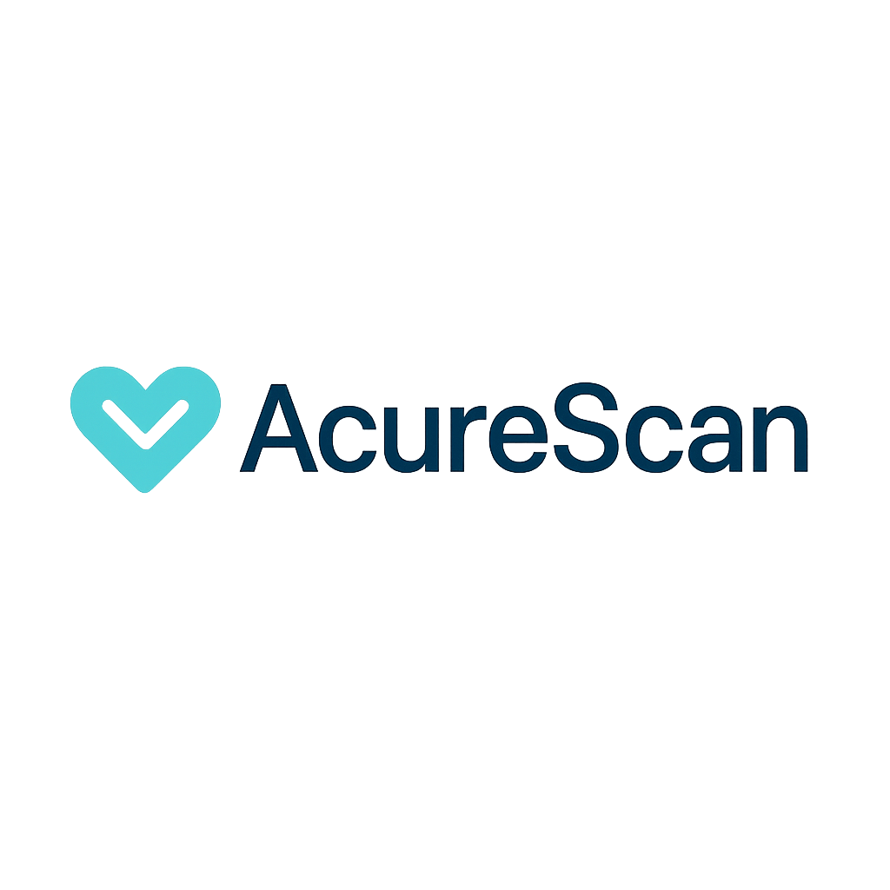

# AcureScan - Acne Detection & Treatment Application



## 📋 Overview

AcureScan is a web application that utilizes machine learning to detect, classify, and provide treatment recommendations for acne. The application helps users identify their acne type, receive personalized medication recommendations, and learn proper treatment methods.

## ✨ Features

- **Acne Detection**: Upload a photo of your face to detect the presence of acne
- **Type Classification**: AI-powered analysis to identify different types of acne
- **Treatment Recommendations**: Get personalized medication recommendations based on your acne type
- **Care Instructions**: Learn proper skincare methods for treating your specific acne condition
- **User Accounts**: Create an account to save your analysis history and track your progress
- **Responsive Design**: Seamless experience across all devices

## 🚀 Technologies

### Frontend

- HTML5, CSS3, JavaScript (ES6+)
- Tailwind CSS for styling
- Custom Web Components for modularity

### Backend

- Node.js
- Webpack for module bundling
- Service Workers for offline functionality

### Machine Learning

- Custom-trained image recognition model for acne detection and classification

## 📁 Project Structure

```
├── dist/                   # Production build output
├── node_modules/           # Node.js dependencies
├── src/                    # Source files
│   ├── public/             # Public assets
│   │   ├── images/         # Image assets
│   │   └── favicon.png     # Application favicon
│   ├── scripts/            # JavaScript source files
│   │   ├── data/           # Data handlers
│   │   │   ├── api.js      # API integration
│   │   │   └── database.js # Local data storage
│   │   ├── pages/          # Page components
│   │   │   ├── auth/       # Authentication pages
│   │   │   │   ├── login/  # Login page components
│   │   │   │   └── register/# Registration page components
│   │   │   ├── landing/    # Landing page components
│   │   │   └── app.js      # Main application component
│   │   ├── routes/         # Routing configuration
│   │   │   ├── routes.js   # Route definitions
│   │   │   └── url-parser.js# URL parsing utilities
│   │   ├── utils/          # Utility functions
│   │   ├── index.js        # Main JavaScript entry point
│   │   └── sw.js           # Service Worker
│   ├── styles/             # CSS styles
│   │   └── styles.css      # Main stylesheet
│   └── index.html          # HTML entry point
├── .gitignore              # Git ignore file
├── package-lock.json       # NPM package lock file
├── package.json            # NPM package configuration
├── postcss.config.js       # PostCSS configuration
├── README.md               # Project documentation
├── tailwind.config.js      # Tailwind CSS configuration
├── webpack.common.js       # Common webpack configuration
├── webpack.dev.js          # Development webpack configuration
└── webpack.prod.js         # Production webpack configuration
```

## 🛠️ Installation

1. Clone the repository:

    ```bash
    git clone https://github.com/yourusername/acurescan.git
    cd acurescan
    ```

2. Install dependencies:

    ```bash
    npm install
    ```

3. Start the development server:

    ```bash
    npm run start-dev
    ```

4. For production build:

    ```bash
    npm run build
    ```

5. To serve the production build:
    ```bash
    npm run serve
    ```

## 🧠 How It Works

AcureScan uses a trained machine learning model to:

1. **Detect** acne presence in user-uploaded facial images
2. **Classify** detected acne into different types (e.g., papules, pustules, nodules, cysts)
3. **Analyze** severity and distribution patterns
4. **Recommend** appropriate treatments based on acne type and severity
5. **Provide** personalized skincare routines and treatment instructions

## 👨‍💻 Development Workflow

The application is built using custom Web Components for modularity:

- Each page is a self-contained component
- Components follow the MVP (Model-View-Presenter) pattern with separate:
    - `-page.js` files for component definition (View)
    - `-presenter.js` files for business logic (Presenter)
- Routing is handled via hash-based navigation
- Data persistence uses IndexedDB through the idb library

## 📱 Progressive Web App Features

AcureScan is built as a Progressive Web App (PWA) with:

- Service Worker for offline capabilities
- Responsive design for all device sizes
- Installable on compatible devices
- Fast loading and smooth performance

## 🔒 Privacy and Data Handling

- All facial analysis is performed locally on the user's device
- Image data is not stored permanently unless explicitly saved by the user
- User preferences and history are stored securely in the browser's local storage

## 📝 License

This project is licensed under the MIT License - see the LICENSE file for details.

## 📞 Contact

For questions, feedback, or support, please contact:

- Email: abdabdulziza@gmail.com
- GitHub: [mabduls](https://github.com/mabduls)

---

© 2025 AcureScan. All rights reserved.
